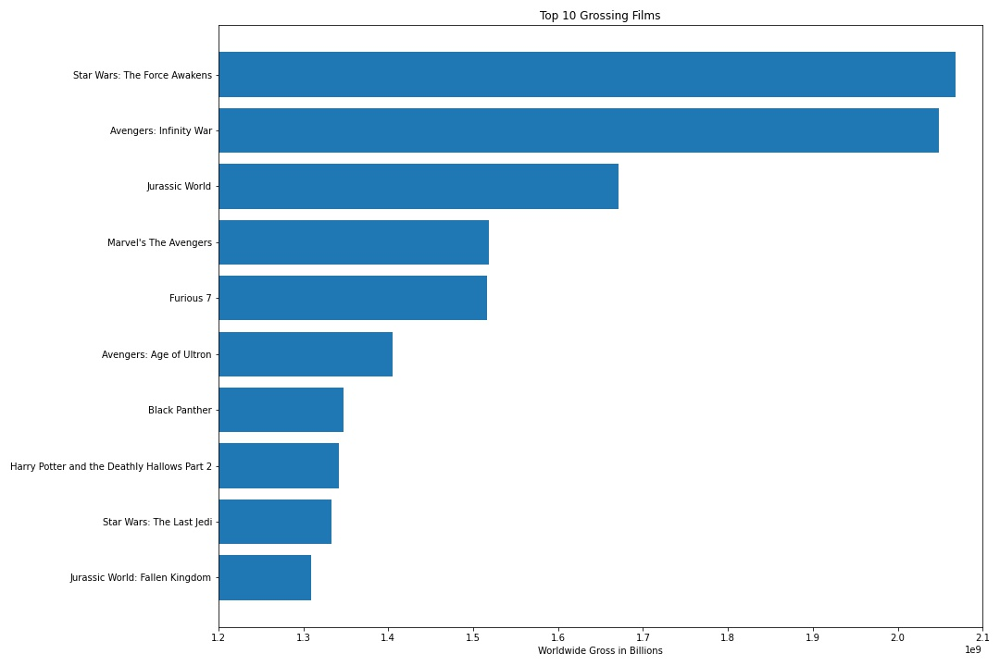
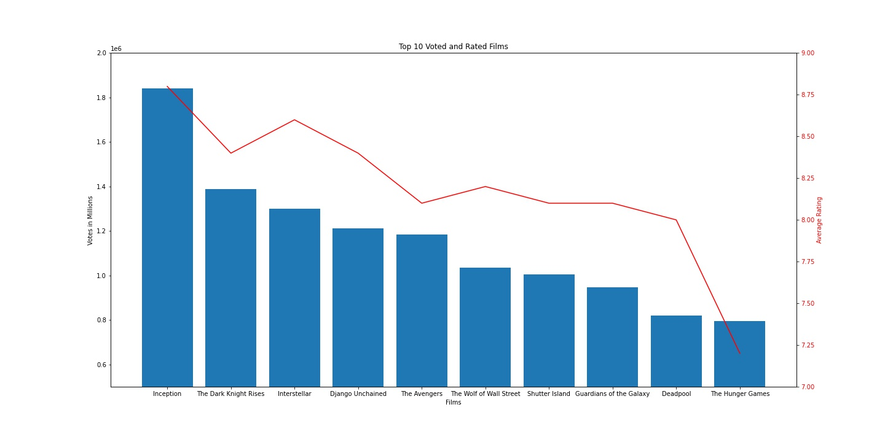
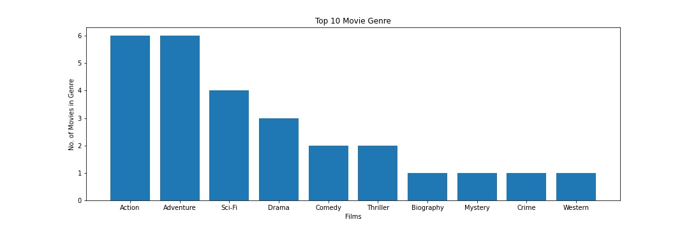
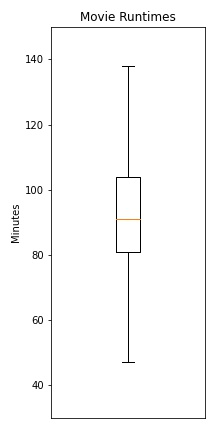

# Title

**Authors**: Ricky Wong

## Overview

Microsoft has decided they want to get into creating original video content with their own movie studio. With a list of top grossing and popular movie titles, popular genres and average runtime Microsoft will have a better understanding of the type of movies they want to make.

## Business Problem

To figure out what kind of movies Microsoft should start making, we must first find out which movies they should draw their inspirations from. From those films we can highlight the genres people enjoy watching and for Microsoft to focus on. To meet their audiences’ expectations, Microsoft would like to know how long the average movie goes for so viewers don’t feel ripped off of get bored. Exploring data from IMDb, an extensive movie database, we are able to come up with successful and popular movie titles, popular genres and average film lengths.

## Data

IMDb is an online database for information related to films and other video entertainment. We have basic data of the movies  which includes the genre, ratings, runtime and also how much each movie made.

### IMDb Title

With the basic data we can find out which genres are popular and how long each movie runs for

### BOM Gross

This data set will help us find how much money each movie made domestic and overseas.

### IMDb Ratings

The average rating and number of votes for each movie. We will need to link this with the previous data set to know the names of the movies.

### BOM Gross

This data set will help us find how much money each movie made domestic and overseas.


## Methods

### Join IMDB title and ratings together
- Merged title and ratings as ratings only had the movie ID, now we can see the rating and know which movie it is for.
- Inner join will remove movies that do not have a rating. This is fine since we are only looking at popular movies.
- 'tconst' is useful for merging tables but is not necesarry for analysing. We can remove 'original_title' as well and just use 'primary_title'
- Renamed a few column names to make it more easy to understand
- Sorting by average rating does not actually show how popular a movie was as the number of votes were low so sort by number of votes is more indicative of popularity

### Movie Gross
- Add 0 to missing gross values
- Unable to convert 'foreign_gross' to float and found values with commas for over a billion
- To maximise profits we should consider international market too not just domestic market

### Genre count
Genre count of the top 10 movies so Microsoft knows what genre to focus on. Can be easily updated if they want to include more movies to the list.


## Results

### Top 10 Grossing Films
Knowing the total gross amount paints a better picture of a films performance. With the bar chart, it highlights how sucessful Star Wars: The Force Awakens and Avengers: Infinity War did. So Microsoft can now dive deeper and find out what made these movies so sucessful. 

### Visual 1


### Vote Count
Vote count is more of a popularity contest but is still important to analyse. We've found that average ratings isn't that reliable as they might only have a few votes. So the main focus is the amount of votes each movie got while the average rating can tell us if most of those votes were good, average or bad. 

### Visual 2


### Top 10 Movies Genre Count
These are the genres of the top 10 movies with the most votes. Some movies had more than 1 genre but we can clearly see that a lot of the movies were both action and adventure.

### Visual 3


### Movie Runtime
Average runtime is important as movie-goers might have an expectation on movie length. They might feel ripped off if it's too short or get bored and fall a sleep if its too long. We can see that Microsoft should aim for 81 to 104 minutes. 

### Visual 4



## Conclusions
Through this analysis we have found 4 points Microsoft’s Movie Studio should take note of.
1.	A successful film is measured in dollars, so we have a list of the top 10 grossing films. Further analysis will be needed on why these are so successful especially **Star Wars: The Force Awakens** and **Avengers: Infinity War** that made over $2 Billion worldwide
2.	Another measure of success are ratings. Apart from **The Hunger Games** the other films did well reaching an average rating of 8 or above. **Inception** did extremely well with the most votes and highest average rating. 
3.	With so many genres it can be difficult to decide what kind of movie to make. We have found half of the 10 top voted movies are **Action** and **Adventure** movies.
4.	75% of the top 10 movies run for 139 to 165 minutes. It is not a must, but the audience will be expecting a movie to run for around that long

Limitations

-	Although IMDb is such a large movie database, it does not include every single movie as the site is more aimed at western audience. However, it is only a small issue as they will most likely be Microsoft’s target audience too.
-	With the rising popularity of streaming services, tv shows/series are also viable options. But this analysis only covered movies. 

Next Steps

-	To expand on how much money a movie made, we can find out the cost of each film and how much the average movie costs. From that we may see if costs are proportionate to the total gross amount
-	Producers/Directors as well as actors also play a major part in the success of a movie. Each of them has their own style and excel at certain genres or roles. Through analysing them we may find out why some of the top movies did so well. 


## For More Information

Please review our full analysis in [our Jupyter Notebook](movie-analysis.ipynb) or our [presentation](./DS_Project_Presentation.pdf).

For any additional questions, please contact ** Ricky wong_ricky@hotmail.com**

## Repository Structure

Describe the structure of your repository and its contents, for example:

```
├── README.md                           <- The top-level README for reviewers of this project
├── dsc-phase1-project-template.ipynb   <- Narrative documentation of analysis in Jupyter notebook
├── DS_Project_Presentation.pdf         <- PDF version of project presentation
├── data                                <- Both sourced externally and generated from code
└── images                              <- Both sourced externally and generated from code
```
